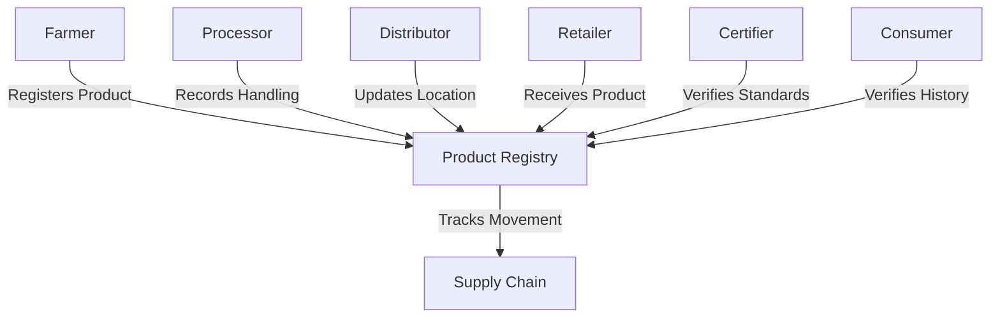

# Agricultural Supply Chain Tracker

A blockchain-based solution for tracking agricultural products from farm to table, providing transparency and authenticity verification throughout the supply chain.

## Overview

The Agricultural Supply Chain Tracker creates an immutable record of agricultural products as they move from farmers through processors, distributors, and retailers to end consumers. The system enables:

- Product registration with detailed origin information
- Real-time tracking of product movements and handling
- Certification verification
- Complete chain of custody documentation
- Supply chain participant verification

## Architecture

The system is built around a central registry contract that manages product tracking, participant registration, and certification verification.



### Core Components

1. **Participant Registry** - Manages supply chain participant registration and roles
2. **Product Tracking** - Records product information and movement
3. **History Tracking** - Maintains chronological records of handling events
4. **Certification System** - Manages product certifications and standards compliance

## Contract Documentation

### farmo-registry.clar

The main contract handling all supply chain tracking functionality.

#### Roles
- Farmer (1)
- Processor (2)
- Distributor (3)
- Retailer (4)
- Certifier (5)

#### Key Functions
- Product registration
- Custody transfers
- Event recording
- Certification management
- Participant management

## Getting Started

### Prerequisites

- Clarinet
- Stacks wallet for contract interaction

### Installation

1. Clone the repository
2. Install dependencies with Clarinet
3. Deploy contracts to your chosen network

## Function Reference

### Participant Management

```clarity
(register-participant (role uint) (name (string-ascii 100)) (location (string-ascii 100)))
```
Registers a new supply chain participant.

### Product Management

```clarity
(register-product 
  (product-id (string-ascii 36)) 
  (name (string-ascii 100)) 
  (description (string-ascii 500))
  (quantity uint)
  (unit (string-ascii 20))
  (harvest-date uint)
  (farming-practices (string-ascii 200))
  (location (string-ascii 100))
  (notes (string-ascii 500)))
```
Registers a new product batch in the system.

### Transfer Management

```clarity
(transfer-product 
  (product-id (string-ascii 36)) 
  (recipient principal) 
  (location (string-ascii 100))
  (notes (string-ascii 500)))
```
Transfers product custody to another participant.

### Certification

```clarity
(certify-product 
  (product-id (string-ascii 36)) 
  (certification-type (string-ascii 100))
  (expiration-date uint)
  (standards-met (string-ascii 500))
  (location (string-ascii 100))
  (notes (string-ascii 500)))
```
Adds certification to a product.

## Development

### Testing

1. Use Clarinet's testing framework to run contract tests
2. Test different roles and scenarios
3. Verify error conditions and access controls

```bash
clarinet test
```

### Local Development

1. Start a local Clarinet console
2. Deploy contracts
3. Test interactions using provided functions

```bash
clarinet console
```

## Security Considerations

### Access Control
- Only registered participants can interact with the system
- Role-based permissions enforce proper access
- Current handler verification for transfers and updates

### Data Validation
- Product IDs must be unique
- All participants must be verified
- Certifications can only be issued by authorized certifiers

### Limitations
- Product quantity updates not supported after initial registration
- No built-in support for product splitting or combining
- Certification renewal process must be handled as new certification